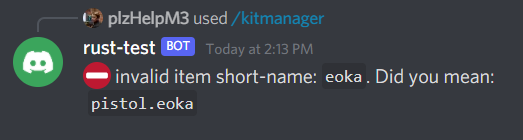

# Rust Discord Kits

## Table of Contents
* [About](#about)
* [Features](#features)
* [Prerequisites](#prerequisites)
* [Installation](#installation)
* [Commands](#commands)
* [Screenshots](#screenshots)

## About
A simple discord bot to create, manage and redeem in-game kits using slash-commands for Rust gaming servers. Also includes a few optional features

## Features
* Redeem and customise kits with slash-commands
* Kit time outs (restrict how often a kit can be redeemed)
* Guard admin commands behind a role
* Display players online as an embedded message (optional)
* Log player reports (optional)
* Assign guild members a role on joining (optional)
* Extra in-game commands, such as: !online and !wipe (optional)
* Send RCON commands via CLI (optional)

## Prerequisites
* Docker/Docker Compose installed (https://docs.docker.com/compose/install/)
* Discord bot token with full admin permissions and slash-commands enabled (https://discordpy.readthedocs.io/en/stable/discord.html)
* Discord bot invited to the guild
* RCON enabled on host Rust server

## Installation
1. Clone the repo ``git clone https://github.com/Morriso8D/rust-bot.git``
2. Navigate to the project's root ``cd rust-bot``
3. Rename the [example.env](./example.env) to '.env' ``mv example.env .env``
4. Open the '.env' file and enter your server's rcon details and discord bot token ``vim .env``
5. Rename [example.config.json](./src/example.config.json) to 'config.json' ``cd src && mv example.config.json config.json``
6. Open 'config.json' and configure the bots setup ``vim config.json``
7. Navigate to the project's root and build the docker image ``cd ../ && docker build .`` (this may take a few minutes)
8. Start the bot ``docker-compose -d up``

## Commands
| Commands             | What it does                                                                 | Dependencies                    |
| -------------------- |:----------------------------------------------------------------------------:|:-------------------------------:|
| ```/kits```          | Displays a select menu of redeemable kits                                    |                                 |
| ```/kitmanager list``` | Paginated list of kits and their assigned items                           | User requires kit manager role  |
| ```/kitmanager add``` | Create a new kit                                                           | User requires kit manager role  |
| ```/kitmanager remove``` | Remove a kit                                                            | User requires kit manager role  |
| ```/kitmanager item add``` | Add an item and its quantity to a kit                                 | User requires kit manager role  |
| ```/kitmanager item remove``` | Remove an item from a kit                                          | User requires kit manager role  |

## Screenshots
Using ```/kits``` to redeem a kit (initially displays a select menu of available kits)

<br/>

Response after redeeming a kit<br/>

<br/>

Kit timeout response<br/>

<br/>

Using ```/kitmanager add``` to create a kit<br/>

<br/>

Using ```/kitmanager remove``` to remove a kit<br/>

<br/>

Using ```/kitmanager item add``` to add an item to a kit<br/>

<br/>

Response after entering an incorrect item short-name<br/>

<br/>

Using ```/kitmanager item remove``` to remove an item from a kit<br/>

<br/>

Using ```/kitmanager list``` to paginate a list of kits and their items<br/>

<br/>

Embedded message of players online (refreshes every 5 minutes)<br/>

